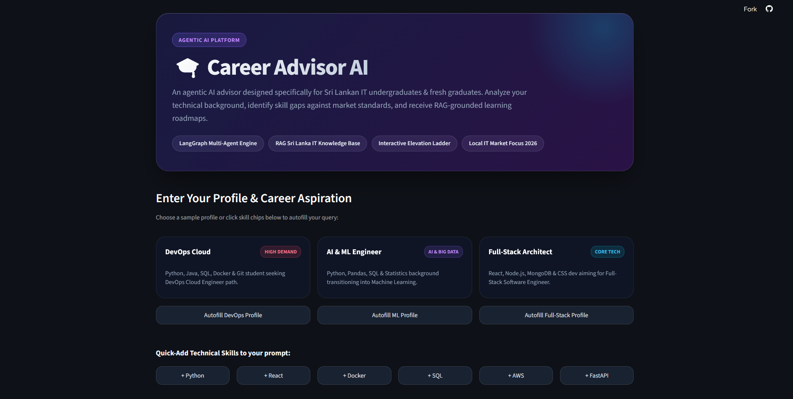
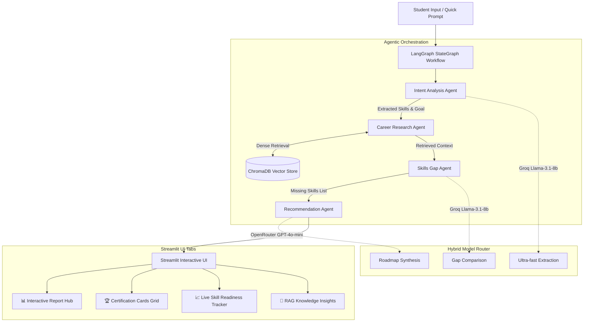

# 🎓 Career Advisor Agentic AI

**Career Advisor Agentic AI** is an intelligent, autonomous multi-agent platform designed to bridge the gap between academic education and industry readiness for IT students, graduates, and aspiring software professionals—with tailored strategic guidance for the **Sri Lankan tech ecosystem**. 

By orchestrating specialized AI agents using **LangGraph**, harnessing a domain-specific **ChromaDB RAG Engine**, and dynamically routing prompts across high-speed and high-reasoning LLMs (**Groq** & **OpenRouter**), the platform converts raw student profile data into personalized career development roadmaps, interactive skill gap matrixes, industry credential recommendations, and local market strategic advice—all delivered through an interactive **Streamlit** web application.



---

## 🌟 Overview & Core Mission

### 💡 The Problem Statement
Navigating the transition from university computer science programs or self-taught coding to landing a high-value software engineering role is fraught with challenges for IT students in Sri Lanka and emerging tech markets:
- **Generic AI Hallucinations**: Standard LLM chatbots often produce vague, surface-level career advice that ignores exact tech stack prerequisites, realistic learning timelines, or credential validity.
- **Regional Market Disconnect**: Global advice rarely accounts for local software export demands (e.g., Sri Lanka's expanding enterprise IT services, FinTech platforms, cloud migrations, and remote engineering opportunities).
- **Curriculum vs. Industry Readiness Gap**: University syllabi often focus heavily on foundational theory while industry hiring demands immediate practical mastery in modern tools (Docker, Kubernetes, CI/CD, Cloud Infrastructure, Microservices).

---

### 🎯 The Agentic AI Solution
**Career Advisor Agentic AI** overcomes these limitations by deploying an orchestrated multi-agent architecture (powered by **LangGraph**) paired with a persistent Retrieval-Augmented Generation (**ChromaDB RAG**) pipeline. Rather than relying on a single monolithic prompt, the system divides career advising into four specialized, state-driven agent nodes:

1. **Stage 1: Intent & Entity Extraction (`Intent Analysis Agent`)**
   - Parses natural, unstructured student prompts (e.g., *"I'm a 3rd-year CS student knowing Python and SQL, wanting to become a Cloud DevOps Engineer"*).
   - Extracts current technical competencies and target career goals into structured state variables using ultra-fast LLM inference (<300ms) or dynamic heuristic extractors.

2. **Stage 2: Grounded Domain Research (`Career Research Agent`)**
   - Queries a persistent vector database (**ChromaDB**) populated with curated job specifications, university benchmarks, domain roadmaps, and Sri Lankan tech sector market guides.
   - Executes dense semantic similarity searches using `sentence-transformers` (`all-MiniLM-L6-v2`) to pull grounded context into the active state.

3. **Stage 3: Comparative Skill Gap Matrix (`Skills Gap Agent`)**
   - Performs automated differential analysis comparing possessed skills against target role prerequisites.
   - Identifies exact technical gaps and categorizes missing competencies into prioritized skill acquisition lists.

4. **Stage 4: Personalized Synthesis & Actionable Roadmap (`Recommendation Agent`)**
   - Synthesizes accumulated state context into a clean, structured career advisory report.
   - Generates a month-by-month learning plan, recommended industry certification paths (AWS, Azure, CKA, CompTIA), strategic Sri Lankan tech market guidance, and interactive skill tracking tools inside the web app.

---

## 🚀 Key Features

- **Multi-Agent Orchestration (LangGraph)**:
  - **Intent Analysis Agent**: Extracts student skills and target goals.
  - **Career Research Agent**: Fetches dense RAG context from ChromaDB.
  - **Skills Gap Analysis Agent**: Identifies missing technical prerequisites.
  - **Recommendation Agent**: Synthesizes structured, empathetic career roadmaps.
  
- **Dynamic Hybrid LLM Router**:
  - **Groq (`llama-3.1-8b-instant`)**: Sub-300ms ultra-fast inference for high-frequency extractions & list comparisons.
  - **OpenRouter (`openai/gpt-4o-mini` / Claude models)**: High-reasoning model for roadmap synthesis.
  - **Dynamic Offline Fallback**: Works seamless out-of-the-box even without API keys using contextual heuristics.
  
- **ChromaDB RAG Engine**:
  - Semantic vector search using `sentence-transformers` embeddings over custom curriculum documents, job descriptions, roadmaps, and certification guides.
  
- **Interactive Streamlit Dashboard**:
  - **Interactive Report Hub**: Section filtering, keyword highlight search, raw markdown viewer, and 1-click Markdown export.
  - **Industry Certification Grid**: Interactive credential cards with status toggles (`Mark as Achieved`) and live counters.
  - **Live Skill Readiness Tracker**: Interactive checkboxes for missing skills with real-time `% readiness score` calculation and progress bar.
  - **RAG Knowledge Insights**: Transparent viewing of verified background sources retrieved for analysis.
  
- **Production-Ready & Lightweight Docker Container**:
  - Multi-stage build with `python:3.11-slim` and CPU-only PyTorch index (saves **~2.2 GB**).
  - Secure execution with a non-root user (`appuser`).

---

## 🏗 System Architecture & Workflow



---

## 📁 Project Structure

```
career-advisor-agentic-ai/
├── agents/
│   ├── career_research_agent.py
│   ├── graph.py
│   ├── intent_analysis_agent.py
│   ├── recommendation_agent.py
│   ├── skills_gap_agent.py
│   ├── state.py
│   └── test_graph.py
├── data/
│   ├── career_guides/
│   ├── certifications/
│   ├── job_descriptions/
│   └── roadmaps/
├── models/
│   └── model_router.py
├── rag/
│   ├── chroma_db/
│   ├── chunking.py
│   ├── embed_store.py
│   ├── ingest.py
│   ├── retrieve.py
│   └── test_retrieval.py
├── utils/
│   └── secrets.py
├── app.py
├── Dockerfile
├── docker-compose.yml
├── requirements.txt
└── README.md
```

---

## 🛠 Detailed Local Setup & Installation Guide

Follow these comprehensive step-by-step instructions to configure, initialize, and launch **Career Advisor Agentic AI** in your local development environment.

---

### 📋 Prerequisites & System Requirements

Before beginning setup, ensure your local system meets the following prerequisites:
- **Operating System**: Windows 10/11, macOS (Intel or Apple Silicon), or Ubuntu/Debian Linux.
- **Python**: **Python 3.10** or **3.11** (Python 3.11 recommended). Verify by running `python --version`.
- **Git**: Installed and available in system PATH (`git --version`).
- **C++ Compiler Tools** *(Windows Users)*: ChromaDB relies on `hnswlib`. Ensure **Visual Studio C++ Build Tools** or standard C++ compilation capabilities are installed.

---

### Step 1: Repository Cloning & Directory Entry

Clone the project repository to your local machine and navigate into the root directory:

```bash
# Clone the repository via HTTPS
git clone https://github.com/sachilz/career-advisor-agentic-ai.git

# Move into the project directory
cd career-advisor-agentic-ai
```

---

### Step 2: Virtual Environment Setup

Isolate project dependencies by creating a dedicated Python virtual environment (`venv`):

#### 1. Create Virtual Environment
```bash
python -m venv venv
```

#### 2. Activate Virtual Environment
Activate the environment according to your operating system and shell choice:

- **Windows (PowerShell - Recommended)**:
  ```powershell
  .\venv\Scripts\Activate.ps1
  ```
  *(If PowerShell returns an execution policy error, run `Set-ExecutionPolicy -ExecutionPolicy RemoteSigned -Scope Process` first).*

- **Windows (Command Prompt / CMD)**:
  ```cmd
  .\venv\Scripts\activate.bat
  ```

- **macOS / Linux (Bash / Zsh)**:
  ```bash
  source venv/bin/activate
  ```

Once activated, your terminal prompt will display `(venv)` at the beginning of the command line.

---

### Step 3: Upgrading Pip & Installing Dependencies

Ensure `pip` is updated to the latest version, then install all required packages:

```bash
# Upgrade package installer
python -m pip install --upgrade pip

# Install project dependencies
pip install -r requirements.txt
```

#### Key Dependencies Installed:
- **`streamlit`**: Web application interface & reactive session management.
- **`langgraph` & `langchain`**: StateGraph multi-agent flow orchestration.
- **`chromadb` & `sentence-transformers`**: Dense vector database and embeddings (`all-MiniLM-L6-v2`).
- **`langchain-groq` & `langchain-openai`**: API connectors for Groq and OpenRouter endpoints.
- **`python-dotenv`**: Environment variable loading from `.env`.

---

### Step 4: Environment Variables & Secrets Configuration

1. Create a `.env` file in the project root directory:
   ```bash
   # Create .env file manually or via terminal:
   touch .env
   ```

2. Open `.env` in your code editor and configure your API credentials:
   ```ini
   # Groq API Key (Used for Intent Extraction & Skills Gap Analysis)
   # Obtain key from: https://console.groq.com/
   GROQ_API_KEY=gsk_your_actual_groq_api_key_here

   # OpenRouter API Key (Used for Roadmap & Strategic Advice Synthesis)
   # Obtain key from: https://openrouter.ai/keys
   OPENROUTER_API_KEY=sk-or-v1-your_actual_openrouter_api_key_here
   ```

> 💡 **Keyless / Offline Mode**: If you do not have API keys available, leave the keys blank or unconfigured. The system will automatically engage the **Dynamic Fallback Engine**, enabling full feature demonstration and UI interaction completely offline.

---

### Step 5: Data Ingestion & RAG Knowledge Base Initialization

The repository includes pre-built vector database files in `rag/chroma_db/`. However, if you add new custom documents (`.txt`, `.pdf`, `.md`) to the `data/` directory, re-ingest the knowledge base to refresh vector embeddings:

```bash
# Run the ingestion script to process, chunk, embed, and index documents
python rag/ingest.py
```

#### What happens during ingestion?
1. Reads all documents inside `data/career_guides/`, `data/certifications/`, `data/job_descriptions/`, and `data/roadmaps/`.
2. Splits text into semantic chunks using `RecursiveCharacterTextSplitter`.
3. Computes 384-dimensional dense embeddings using `sentence-transformers/all-MiniLM-L6-v2`.
4. Persists vector indexes into `rag/chroma_db/`.

---

### Step 6: Launching the Web Application

Start the Streamlit development server:

```bash
streamlit run app.py
```

Once initialized, Streamlit will display the local and network access URLs:
```
  You can now view your Streamlit app in your browser.

  Local URL: http://localhost:8501
  Network URL: http://192.168.x.x:8501
```

Open **`http://localhost:8501`** in your web browser to access **Career Advisor Agentic AI**.

---

## 🐳 Detailed Docker Deployment Guide

The project includes an enterprise-ready, multi-stage [`Dockerfile`](file:///c:/Users/sachintha/Desktop/New%20folder/career-advisor-agentic-ai/Dockerfile) and [`docker-compose.yml`](file:///c:/Users/sachintha/Desktop/New%20folder/career-advisor-agentic-ai/docker-compose.yml) optimized for lightweight footprint, speed, and container security.

---

### Lightweight Container Optimizations

Building AI and RAG applications in Docker often results in bloated multi-gigabyte container images. This project applies four key production optimizations:

1. **Multi-Stage Build Pattern**: Separates compilation and package installation from runtime execution, keeping build tools and cached wheels outside the final container.

2. **CPU-Only PyTorch Installation**: `sentence-transformers` requires PyTorch. By installing CPU-only wheels (`--index-url https://download.pytorch.org/whl/cpu`), GPU/CUDA binaries are excluded—**reducing final container image size by ~2.2 GB**.

3. **Non-Root Security Model**: Operates as a unprivileged non-root user (`appuser`, UID `10001`) with restricted filesystem permissions.

4. **Automated Container Healthchecks**: Built-in HTTP healthchecks (`curl http://localhost:8501/_stcore/health`) ensure container orchestrators automatically detect server readiness.

---

### Method 1: Deployment via Docker Compose (Recommended)

Docker Compose provides a single-command deployment with volume persistence and environment variable pass-through.

#### 1. Start Container Service
Build and run the container in detached background mode:
```bash
docker compose up -d --build
```

#### 2. Monitor Container Logs
View live streaming application logs:
```bash
docker compose logs -f career-advisor
```

#### 3. Access Application
Open **`http://localhost:8501`** in your browser.

#### 4. Stop Container Service
Gracefully terminate the container service:
```bash
docker compose down
```

---

### Method 2: Deployment via Manual Docker CLI Commands

If deploying without Docker Compose, use raw `docker` CLI commands:

#### 1. Build Docker Image
```bash
docker build -t career-advisor-agentic-ai:latest .
```

#### 2. Run Container with Persistent Volume Mount
Run container with environment variable injection and persistent host mounting for ChromaDB:

- **Linux / macOS**:
  ```bash
  docker run -d \
    --name career_advisor_ai \
    -p 8501:8501 \
    --env-file .env \
    -v "$(pwd)/rag/chroma_db:/app/rag/chroma_db" \
    career-advisor-agentic-ai:latest
  ```

- **Windows (PowerShell)**:
  ```powershell
  docker run -d `
    --name career_advisor_ai `
    -p 8501:8501 `
    --env-file .env `
    -v "${PWD}/rag/chroma_db:/app/rag/chroma_db" `
    career-advisor-agentic-ai:latest
  ```

---

### 🔍 Container Health Check & Diagnostics

Check container status and verify health checks:

```bash
# Verify running container status and health state
docker ps --filter "name=career_advisor_ai"

# View container logs
docker logs -f career_advisor_ai

# Execute interactive shell inside running container
docker exec -it career_advisor_ai /bin/bash
```

---

## ⚙️ Hybrid Model Routing & LLM Orchestration Architecture

To optimize performance, latency, cost efficiency, and response quality across the multi-agent graph, **Career Advisor Agentic AI** employs a **Hybrid LLM Routing Architecture** implemented in [`models/model_router.py`](file:///c:/Users/sachintha/Desktop/New%20folder/career-advisor-agentic-ai/models/model_router.py).

Different agent tasks have radically different computational needs. High-frequency extraction tasks require sub-second speed and deterministic schema adherence, while final roadmap synthesis demands deep multi-step reasoning and empathetic formatting.

---

### 📊 Model Routing Matrix

| Agent Node | Primary Provider | Active Model | Task Responsibilities | Trade-Off & Latency Rationale |
| :--- | :--- | :--- | :--- | :--- |
| **`intent_analysis`** | **Groq Cloud** | `llama-3.1-8b-instant` | Student skill & target goal entity extraction | **Sub-300ms Latency**: Ultra-fast token generation keeps initial user response instant. Highly economical for structured JSON parsing. |
| **`career_research`** | **Local RAG / ChromaDB** | `all-MiniLM-L6-v2` | Dense semantic retrieval over career knowledge base | **Zero API Cost**: Local 384-dimensional vector embeddings run on CPU with zero network latency. |
| **`skills_gap`** | **Groq Cloud** | `llama-3.1-8b-instant` | Comparative differential analysis of possessed vs. missing skills | **Precision List Comparison**: Llama 3.1 8B excels at following JSON schemas and computing set differences accurately. |
| **`recommendation`** | **OpenRouter API** | `openai/gpt-4o-mini` *(or Claude 3.5)* | Multi-section career roadmap synthesis & market advice | **High Reasoning & Synthesis**: Frontier model reasoning produces nuanced, empathetic, structured Markdown roadmaps with custom section headers. |

---

### Provider Trade-Off Rationale

1. **Groq Llama-3.1-8b-Instant (Speed Layer)**
   - **Why used**: Extraction and set-difference tasks do not require massive parameter counts. Groq's LPU (Language Processing Unit) hardware delivers processing speeds of over 500 tokens/sec.
   - **Cost impact**: Eliminates expensive API charges on intermediate graph nodes.

2. **OpenRouter GPT-4o-Mini / Claude (Reasoning Layer)**
   - **Why used**: Synthesizing RAG context, skills gap data, and regional market advice into a cohesive, month-by-month roadmap requires superior long-context coherence, formatting discipline, and human-like empathy.
   - **Cost impact**: Called exactly **ONCE** per user query at the final recommendation stage, keeping token expenditure minimal.

---

## 🧪 Detailed Testing & Verification Guide

**Career Advisor Agentic AI** includes two isolated test suites to verify end-to-end multi-agent graph execution, state key transitions, and vector retrieval semantic precision.

---

### 🤖 Test Suite 1: LangGraph Multi-Agent Orchestration Test

This test harness (`agents/test_graph.py`) executes an end-to-end run of the sequential StateGraph workflow without requiring the Streamlit web server.

#### Execution Command
```bash
python agents/test_graph.py
```

#### What is Tested & Verified?
- **Workflow State Initialization**: Verifies initial prompt injection (`user_input`).
- **`intent_analysis` Node**: Confirms accurate extraction of student technical skills (`skills`) and target goal (`goal`).
- **`career_research` Node**: Verifies tool invocation and dense retrieval count (`retrieved_context`).
- **`skills_gap` Node**: Validates computed set difference list (`missing_skills`).
- **`recommendation` Node**: Verifies final roadmap synthesis text (`final_recommendation`).

#### Sample Console Output
```text
================================================================================
CAREER ADVISOR AGENTIC AI - END-TO-END SYSTEM TEST
================================================================================
Sample Input: "I'm an IT student. I know Python and Java. I want to become a DevOps Engineer."

[State Key 1] user_input: I'm an IT student. I know Python and Java. I want to become a DevOps Engineer.
[State Key 2] Extracted skills (Agent 1): ['Python', 'Java']
[State Key 3] Extracted goal (Agent 1): DevOps Engineer
[State Key 4] Retrieved context count (Agent 2 - RAG Tool Use): Retrieved 3 chunk(s).
[State Key 5] Missing skills (Agent 3): ['Docker', 'Kubernetes', 'CI/CD', 'Terraform', 'Linux Administration']
[State Key 6] Final Recommendation (Agent 4): Synthesized report generated successfully.
================================================================================
END-TO-END TEST SUCCESSFUL! All 4 agents executed and populated state.
================================================================================
```

---

### 📚 Test Suite 2: RAG Vector Search & Retrieval Evaluation

This test harness (`rag/test_retrieval.py`) evaluates the semantic retrieval quality of ChromaDB over 5 standard benchmark career queries.

#### Execution Command
```bash
python rag/test_retrieval.py
```

#### Benchmark Queries Evaluated:
1. *"What skills do I need to become a DevOps Engineer?"*
2. *"What certifications are good for cloud computing beginners?"*
3. *"What does a Data Scientist job description typically require?"*
4. *"How do I prepare for a software engineering interview?"*
5. *"What's the difference between AWS and Azure certifications for beginners?"*

#### Evaluation Output & Metrics
Prints the **Top-K ranked document chunks** (`k=3`), original document source filenames, and L2 distance similarity scores.

---

### 📊 RAG Retrieval Benchmark Log

Document chunk precision and similarity scores are logged in [`rag/retrieval_evaluation.md`](file:///c:/Users/sachintha/Desktop/New%20folder/career-advisor-agentic-ai/rag/retrieval_evaluation.md):

| Benchmark Query | Top Retrieved Document | Similarity Score | Relevant? | Performance Notes |
| :--- | :--- | :---: | :---: | :--- |
| **DevOps Engineer Prerequisites** | `DevOps_Skill_Map.md` | `0.6405` | **Yes** | High precision; retrieves Linux, CI/CD, Docker/K8s, and IaC roadmaps. |
| **Cloud Computing Certifications** | `AWS_Certifications_Guide.md` | `0.6531` | **Yes** | Accurately identifies AWS Cloud Practitioner & Azure AZ-900. |
| **Data Scientist Requirements** | `Data_Scientist_JD.md` | `0.9073` | **Yes** | Excellent match for Python, SQL, and Scikit-Learn requirements. |
| **Software Interview Prep** | `Software_Interview_Prep.md` | `0.5408` | **Yes** | Covers LeetCode DSA, System Design, and STAR behavioral method. |
| **AWS vs. Azure Comparison** | `Azure_vs_AWS.md` | `0.2709` | **Yes** | Strong match; compares startup vs enterprise ecosystem fit. |

---

## 📄 License & Terms

This project is open-source software distributed under the **[MIT License](https://opensource.org/licenses/MIT)**.


